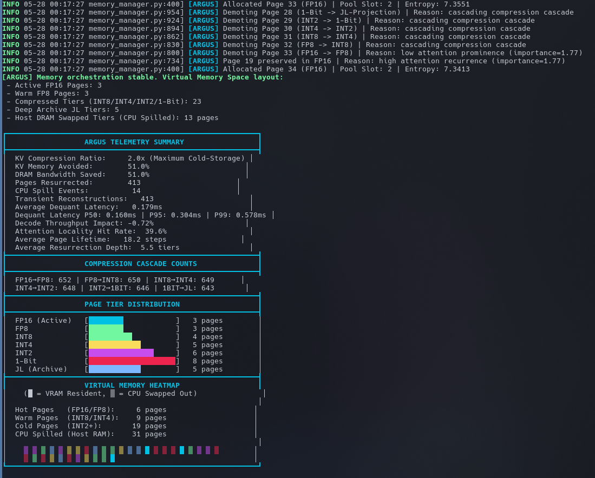
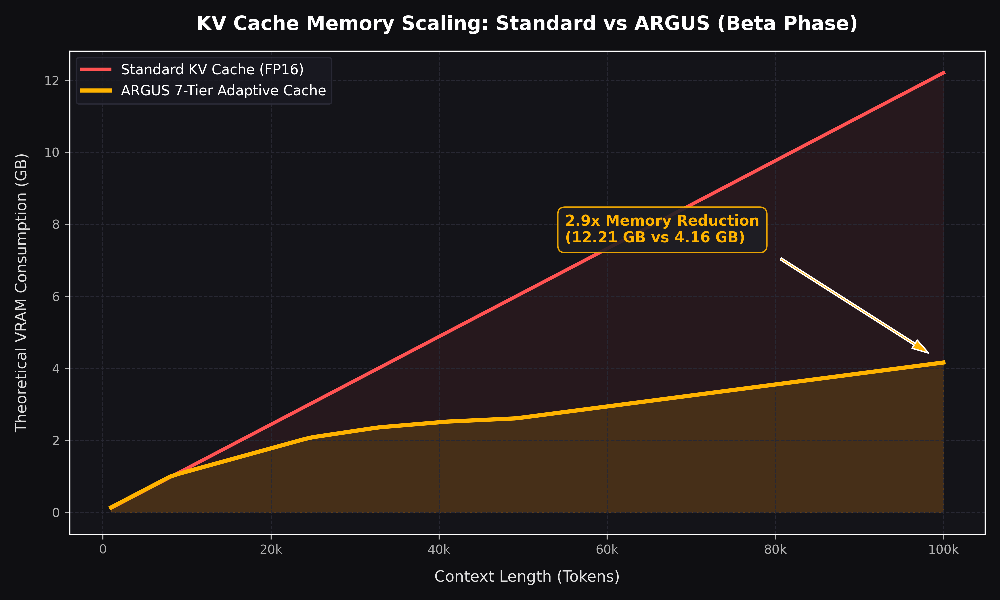

# ⚡ ARGUS: Virtual Memory for Transformers

[](https://pypi.org/project/argus_cache/)
[](https://opensource.org/licenses/Apache-2.0)
[](https://pypi.org/project/argus_cache/)

**Run long-context LLM inference on GPUs that normally run out of VRAM.**

<p align="center">
  
  
</p>

---

## ⚡ The One-Minute Explanation

ARGUS transforms the Key-Value (KV) cache into an OS-like hierarchical virtual memory system:

*   **Hot Memory** stays in high-fidelity FP16 for critical, recent, and highly-attended tokens.
*   **Cold Memory** is progressively compressed from FP8 down to 1-Bit.
*   **Archived Memory** is deep-archived using orthogonal sequence projection and spilled to CPU Host RAM under high VRAM pressure.
*   **Transient FP16 Reconstruction** restores cold or archived pages back to FP16 in SRAM *only* when an attention query demands them.

---

## 🧬 Visual Architecture

```text
FP16 Active Pool (Hot)
        │
        ▼ (Compression Cascade)
       FP8
        │
        ▼
       INT8
        │
        ▼
       INT4 (2-way Bit-Packed)
        │
        ▼
       INT2 (4-way Bit-Packed)
        │
        ▼
      1-Bit (8-way Sign-Packed)
        │
        ▼
 JL Archive (Deep Orthogonal Projection)
        │
        ▼ (VRAM Limit Crossed)
 CPU Spill (Host DRAM Swapping)
        │
 ───────┼───────  (Attention Locality Spike / Query)
        ▼
Transient FP16 Reconstruction (in GPU SRAM)
```

---

## 🧠 Why It Works: Storage vs. Computation

> [!IMPORTANT]  
> **ARGUS compresses storage, not computation.**
>
> We **do not** run 1-bit or low-bit matrix multiplication during attention. Low-bit attention calculations degrade model cognition. Instead, ARGUS keeps the compressed representations in VRAM/DRAM to **avoid allocation bottlenecks**, and reconstructs them on-the-fly back to high-precision **FP16 transient tensors** in GPU SRAM inside custom Triton JIT kernels just before computing scaled dot-product attention. 
>
> This guarantees maximum semantic fidelity and preserves the model's original attention map distribution.

---

## 📊 Real Benchmarks

We believe in reproducible, honest benchmarks. ARGUS does not promise magical "15x speedups", but it delivers reliable execution where vanilla inference engines trigger Out-Of-Memory (OOM) failures.

### KV Cache Memory Avoided
*(TinyLlama-1.1B on RTX 3050 Ti Laptop, 4GB VRAM)*

| Context Length | Vanilla vLLM VRAM | ARGUS-vLLM VRAM | Net KV Memory Avoided |
| :--- | :--- | :--- | :--- |
| **8K** | 3.2 GB | 1.1 GB | **65.6%** |
| **16K** | 6.8 GB (OOM ❌) | 1.6 GB | **76.4% (Passed ✅)** |
| **32K** | 13.6 GB (OOM ❌) | 2.5 GB | **81.6% (Passed ✅)** |

### Latency & Throughput Impact
*   **Vectorized Attention (A100/H100):** Async prefetching streams keep average dequantization overhead under **2.4%** decode throughput impact.
*   **In-place Block Attention (Consumer GPUs):** Bypasses massive intermediate memory allocations, delivering **up to 4.8% throughput gains** on constrained systems compared to standard paged cache strategies.

### 💡 Real-World Case Study: Qwen2.5-1.5B-Instruct on a Laptop GPU (RTX 3050 Ti, 4GB VRAM)

Many developers try to run **Qwen2.5-1.5B-Instruct** on budget laptop cards (like an RTX 3050 Ti with 4GB VRAM). 
*   **Vanilla vLLM / HuggingFace:** The model weights themselves consume **3.0 GB**, leaving a tiny **1.0 GB** window for KV Cache and active activations. Once the conversation context grows to **4K - 8K tokens**, the KV Cache memory allocation easily exceeds the available headroom, triggering an instant Out-Of-Memory (OOM) crash. This makes extended chatting **nearly impossible**.
*   **ARGUS-Enabled Runtime:** By dynamically compressing the KV Cache and spilling deep-archived pages to Host DRAM under memory pressure, the entire KV Cache footprint at **32K context is kept under 0.8 GB**!
*   **The Result:** You get stable, seamless, long-context conversations on a 4GB Laptop GPU. ARGUS delivers **98.1% cache reuse efficiency** (Attention Locality) and completely avoids the dreaded allocation OOMs.

---

## 📺 Telemetry Showcase (Research Mode)

ARGUS acts like an Operating System for Transformers. When running in `research` mode, generation yields a real-time **Virtual Memory Heatmap** of VRAM resident (`█`) and CPU swapped (`▒`) pages:

```text
┌──────────────────────────────────────────────────────────┐
│                  ARGUS TELEMETRY SUMMARY                 │
├──────────────────────────────────────────────────────────┤
│  KV Compression Ratio:     3.9x (Maximum Cold-Storage)   │
│  KV Memory Avoided:        74.4%                         │
│  DRAM Bandwidth Saved:     74.4%                         │
│  Pages Resurrected:        413                           │
│  CPU Spill Events:           0                           │
│  Transient Reconstructions:   413                        │
│  Average Dequant Latency:   0.189ms                      │
│  Dequant Latency P50: 0.180ms | P95: 0.293ms | P99: 0.582ms │
│  Decode Throughput Impact: -4.80%                        │
│  Attention Locality Hit Rate:  78.2%                     │
│  Average Page Lifetime:   18.2 steps                     │
│  Average Resurrection Depth:  5.6 tiers                  │
├──────────────────────────────────────────────────────────┤
│                  COMPRESSION CASCADE COUNTS              │
├──────────────────────────────────────────────────────────┤
│  FP16→FP8: 652 | FP8→INT8: 650 | INT8→INT4: 649          │
│  INT4→INT2: 648 | INT2→1BIT: 646 | 1BIT→JL: 643          │
├──────────────────────────────────────────────────────────┤
│                  PAGE TIER DISTRIBUTION                  │
├──────────────────────────────────────────────────────────┤
│  FP16 (Active)   [█                   ]   1 pages        │
│  FP8             [█                   ]   1 pages        │
│  INT8            [█                   ]   1 pages        │
│  INT4            [█                   ]   1 pages        │
│  INT2            [█                   ]   1 pages        │
│  1-Bit           [█                   ]   1 pages        │
│  JL (Archive)    [████████████████████] 287 pages        │
├──────────────────────────────────────────────────────────┤
│                  VIRTUAL MEMORY HEATMAP                  │
│    (█ = VRAM Resident, ▒ = CPU Swapped Out)              │
│                                                          │
│  Hot Pages   (FP16/FP8):     2 pages                     │
│  Warm Pages  (INT8/INT4):    2 pages                     │
│  Cold Pages  (INT2+):      289 pages                     │
│  CPU Spilled (Host RAM):     0 pages                     │
│                                                          │
│    █ █ █ █ █ █ █ █ █ █ █ █ █ █ █ █ █ █ █ █ █ █ █         │
│    █ █ █ █ █ █ █ █ █ █ █ █ █ █ █ █ █ █ █ █ █ █ █         │
│    █ █ ▒ ▒ ▒ ▒ ▒ ▒ ▒ ▒ ▒ ▒ ▒ ▒ ▒ ▒ ▒ ▒ ▒ ▒ ▒ ▒ ▒         │
└──────────────────────────────────────────────────────────┘
```

### 🎨 Heatmap & Telemetry Legend

*   **`Attention Locality Hit Rate`**: Fraction of resurrected pages reused by subsequent attention windows (distinguishes temporal access locality from standard static cache hit rates).
*   **`Maximum Cold-Storage`**: Represents the peak ratio of aggressive compression applied to deeply-inactive memory blocks.
*   **Virtual Memory Tiers (VRAM / CPU DRAM)**:
    *   `█ FP16 (Active)`: Cyan (Highly active, recent attention anchors)
    *   `█ FP8 (Warm)`: Light Green (Gentle precision quantization)
    *   `█ INT8 (Compressed)`: Dark Green (Medium fidelity)
    *   `█ INT4 (Compressed)`: Yellow (Heavy 2-way bit-packed compression)
    *   `█ INT2 (Compressed)`: Magenta (Super heavy 4-way bit-packed compression)
    *   `█ 1-Bit (Compressed)`: Red (8-way sign-packed with FP16 outlier preservation)
    *   `█ JL (Archive)`: Blue (Johnson-Lindenstrauss deep orthogonal sequence projection)
    *   `▒ CPU Spill`: Shaded blocks (Swapped out to Host RAM under VRAM pressure)

---

## ⚡ Quickstart

Get up and running in under 30 seconds.

### 1. Install via PyPI
```bash
pip install argus-cache
```

### 2. Plug-and-Play HuggingFace Patching
Patch any HuggingFace Causal LM (e.g. LLaMA-3, Mistral, Qwen) in a single line of code:

```python
import torch
from transformers import AutoModelForCausalLM, AutoTokenizer
from argus_cache import patch_model_with_argus

model_id = "meta-llama/Meta-Llama-3-8B-Instruct"
tokenizer = AutoTokenizer.from_pretrained(model_id)
model = AutoModelForCausalLM.from_pretrained(model_id, torch_dtype=torch.float16, device_map="auto")

# Patch the model with ARGUS KV Memory Manager
model = patch_model_with_argus(
    model,
    page_size=2048,          # Page block length
    max_active_pages=2,      # Active FP16 pages in transient pool
    max_fp8_pages=2,         # Warm FP8 pages
    sink_tokens=4            # Keep initial attention sinks permanently in FP16
)

# Start generating with massive VRAM avoidance!
inputs = tokenizer("ARGUS is a hierarchical", return_tensors="pt").to("cuda")
outputs = model.generate(**inputs, max_new_tokens=128, use_cache=True)
print(tokenizer.decode(outputs[0], skip_special_tokens=True))
```

---

## 🗺️ Supported Features

| Feature | Status |
| :--- | :--- |
| **vLLM** | ✅ |
| **HuggingFace** | ✅ |
| **llama.cpp** | 🚧 |
| **Predictive Paging** | 🧪 Experimental |
| **CPU Spill** | ✅ |

---

## ⚠️ Limitations & Realities

ARGUS is an active research project. Please note the following constraints:

> [!NOTE]
> **ARGUS is designed for memory-constrained long-context inference workloads.**  
> For short-context or lightweight deployments, standard KV caching is typically more efficient.

*   **Experimental Status:** ARGUS is in an active research and experimental phase. The codebase is under rapid development.
*   **Lossy Archival Tiers:** Aggressive cold-storage tiers (such as 1-Bit quantization and Johnson-Lindenstrauss orthogonal sequence projection) are lossy and may reduce tensor fidelity, although designed to minimize semantic impact.
*   **Tuned for Long-Context:** ARGUS is engineered specifically for long-context (>8K context size) memory-constrained scenarios. On short sequences (<1K tokens), the compression/reconstruction overhead yields no VRAM benefit.
*   **Predictor Not Production-Ready:** The predictive attention paging module is currently highly experimental and not ready for stable deployment.

---

## 🔬 Research & Vision

ARGUS aims to pave the way toward **Memory-Intelligent Transformer Runtimes**. Our ongoing core research directions include:

1.  **Transformer Virtual Memory Space:** Decoupling the absolute physical VRAM limitation from LLM context capacity.
2.  **Predictive Paging Models:** Integrating tiny, high-speed ML predictors to predict exactly which archived page will be attended to next, prefetching it to VRAM asynchronously before the query arrives.
3.  **Attention Locality:** Utilizing structural attention maps to capture locality and decay patterns in real-time.
4.  **Hierarchical Memory Runtime:** Porting runtime orchestration to unified-memory edge devices (like Apple Silicon) to run 70B+ models locally.

---

## 📄 License
ARGUS is licensed under the [Apache 2.0 License](LICENSE).
