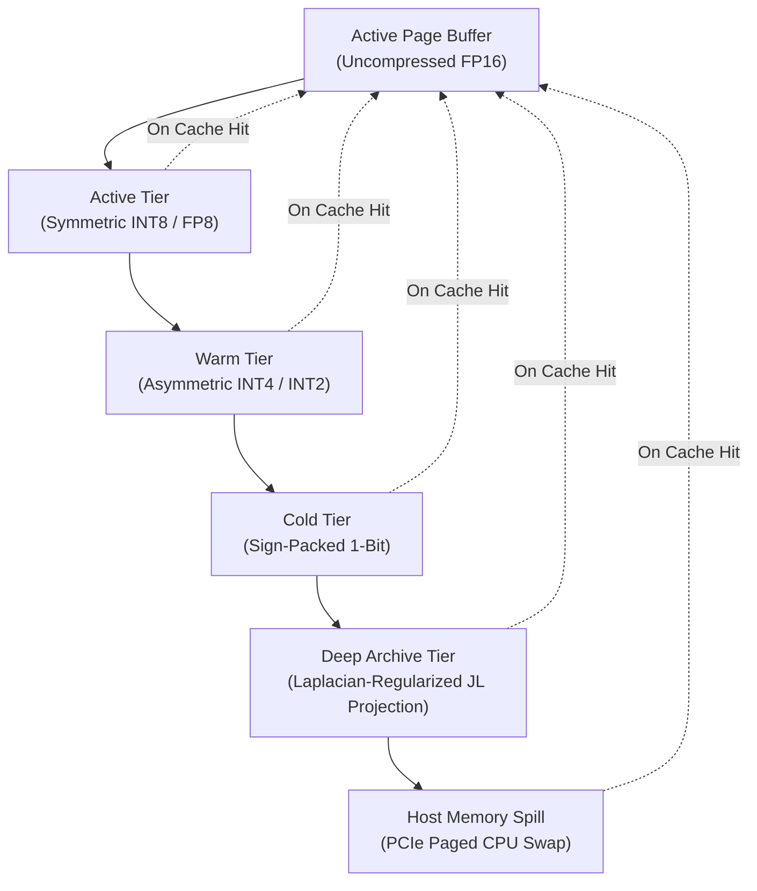

# ARGUS Cache Architecture Reference

This document provides a comprehensive technical overview of the **ARGUS (Anchored Random Geometric Unbiased Storage)** KV Cache virtual memory runtime. It outlines the internal state machine, compression cascade mechanics, API contracts, custom Triton JIT kernels, attention integration, and the host memory paging subsystem.

---

## 1. Page Lifecycle & State Machine

ARGUS operates as a virtual memory paging manager for Large Language Model (LLM) Key-Value (KV) attention states. Rather than keeping all KV tensors in uncompressed FP16 format, ARGUS implements a cascading, multi-tiered memory hierarchy.

### 1.1. Virtual Memory Hierarchy Flow

The lifecycle of an attention cache page flows through progressive stages of compression and hardware relocation under memory pressure:



### 1.2. Eviction & Tier Transition Policy

Transition between tiers is governed by an **Importance-Scored Least Recently Used (IS-LRU)** eviction policy. Instead of a naive LRU that only tracks temporal recency, the score $S_p$ of page $p$ is calculated as:

$$S_p = \lambda_1 \cdot \text{Recency} + \lambda_2 \cdot \text{AccessFrequency} + \lambda_3 \cdot H(K_p, V_p)$$

Where:
- **Recency:** Time elapsed since the page was last queried in the attention lookup.
- **AccessFrequency:** Historical reuse counter within a shifting window.
- **Entropy ($H$):** Information entropy of the page's KV activations. High-entropy states (containing critical outlier features) are protected from lossy compression tiers and preserved in high-precision tiers longer.

When VRAM allocated to active pages exceeds the configured safety threshold (e.g., 90% of available capacity), pages with the lowest $S_p$ scores are evicted downward through the compression cascade:
1. **FP16 → INT8/FP8:** Lossless dynamic range packing.
2. **INT8 → INT4/INT2:** Asymmetric sub-byte packing with outlier sidecar generation.
3. **INT4/INT2 → 1-Bit:** Sign-packing to single bits with localized channel scaling factors.
4. **1-Bit → JL Archive:** Multi-dimensional random projection shrinking sequence length.
5. **VRAM → Host DRAM:** Paged asynchronous transfer over PCIe to system RAM.

### 1.3. Resurrection Path

When a compressed or spilled page is needed for attention computation:
1. It is fetched from its current location (spilled pages are read back from Host DRAM asynchronously).
2. The page is **resurrected** back into active GPU SRAM.
3. Inside custom Triton JIT kernels, it is decompressed on-the-fly into **transient FP16 tensors** directly in SRAM.
4. Scale-dot product attention is calculated immediately. The transient FP16 block is discarded from SRAM after attention, preserving the compressed format in storage.

---

## 2. Compression Cascade Mechanics

To preserve extreme semantic accuracy while reducing storage footprint up to 10x, ARGUS uses a structured compression cascade that pairs quantization with geometric dimensionality reduction.

### 2.1. Outlier Isolation & Sidecar Storage

Model cognition resides heavily in a small subset of "outlier features" (attention channels with disproportionately large magnitudes). Standard uniform quantization collapses these features, causing severe perplexity degradation.

ARGUS isolates outliers using a **1-Pass $\sigma$-Threshold Filter** during tier-downward transitions:

1. For a page $X$, channel-wise standard deviation $\sigma_c$ and mean $\mu_c$ are calculated.
2. Outlier channels are identified where $|X_{t, c} - \mu_c| > k \cdot \sigma_c$ (typically $k = 3.2$).
3. These outlier coordinates and their exact FP16 values are saved to a lightweight **Outlier Sidecar** metadata structure.
4. The remaining "non-outlier" background distribution is tightly quantized to INT4 or INT2.
5. During reconstruction, the quantized background is unpacked, and the exact FP16 outlier features are re-injected (scattered) back into their original spatial coordinates.

### 2.2. Sign-Packed 1-Bit Quantization

For the cold-storage tier, KV tensors are binarized using sign packing:

$$B_{i, j} = \operatorname{sign}(X_{i, j}) \in \{-1, +1\}$$

These sign bits are packed along the channel dimension into 32-bit integers (`uint32`). Scale vectors are stored per head and per page to scale the reconstructed signs back to the appropriate activation range:

$$\hat{X}_{i, j} = S_{head} \cdot B_{i, j}$$

### 2.3. Laplacian-Regularized Johnson-Lindenstrauss Projection

When context grows past the 1-bit threshold, sequence-length compression is required. ARGUS applies the Johnson-Lindenstrauss (JL) lemma using an orthogonal random projection matrix $W \in \mathbb{R}^{m \times n}$ (where $m = n / 4$ is the compressed dimension):

$$Y = W X$$

Standard JL reconstruction using the transpose $W^T Y$ yields poor accuracy because it treats the projected signal as unstructured white noise. ARGUS exploits the **temporal continuity and smoothness** of attention states along the sequence dimension by solving a Laplacian-regularized inverse problem:

$$\min_{X} \| D_{diff} X \|_F^2 \quad \text{subject to} \quad W X = Y$$

Where $D_{diff}$ is the finite-difference operator representing sequence derivative. This yields the closed-form, deterministic reconstruction operator:

$$R = A^{-1} W^T (W A^{-1} W^T)^{-1}$$

Where $A = L + \alpha I$ is the regularized graph Laplacian matrix representing sequence-temporal connections. This operator $R$ is precomputed and cached ahead-of-time during initial context packing, ensuring that reconstruction is a simple, non-iterative matrix multiplication at runtime.

---

## 3. Cache Manager API Contracts

ARGUS integrates into standard LLM execution frameworks (e.g., HuggingFace Transformers, vLLM) via a clean, structured cache abstraction layer.

### 3.1. `PagedDynamicKVCache` Interface

The primary orchestrator of the physical and virtual pages is `PagedDynamicKVCache`:

*   **`allocate_session(session_id, max_seq_len)`**: Initializes page metadata structures and assigns virtual page tables for a new generation session.
*   **`append_keys_values(session_id, keys, values)`**: Appends raw FP16 key and value tensors. Triggers the cascading eviction sequence if active memory headroom falls below threshold bounds.
*   **`get_keys_values_for_step(session_id, step)`**: Returns the transient FP16 keys and values required for attention calculation at a specific generation index, performing on-the-fly JIT decompression where necessary.
*   **`evict_tier_down(page_id)`**: Forcefully compresses and migrates a specific physical page to the next lower tier in the virtual memory cascade.
*   **`resurrect_page(page_id)`**: Restores a compressed or spilled page back to active residency.

### 3.2. Adaptor & Model Patching Patterns

To support plug-and-play installation without manually rewritten forward passes, ARGUS provides:

*   **`PagedDynamicQuantizedCache`**: A HuggingFace-compatible subclass of `transformers.Cache`. It exposes standard `update()` and `get_seq_len()` methods while secretly driving the paged virtual memory manager underneath.
*   **`patch_model_with_argus(model, config)`**: Dynamically monkey-patches the target model's self-attention modules. It replaces standard KV cache allocations with the ARGUS virtual cache runtime and swaps standard scaled-dot-product attention with the `inplace_paged_attention` execution path.

---

## 4. Triton JIT Kernels

Performance is maintained by keeping all unpacking, scaling, and sidecar injection logic fused within custom CUDA kernels written in **Triton**. This avoids launching multiple small kernels and prevents high-precision activations from spilling back into high-latency VRAM.

### 4.1. Fused Pack/Dequant Triton Kernels

*   **`triton_pack_int4_kernel` / `triton_unpack_int4_kernel`**: Unrolls channel blocks, extracts sign/magnitude scales, performs asymmetric quantization, and packs pairs of 4-bit values into single bytes. Unpacking reads the packed bytes directly to GPU registers, performs register-level scale-and-bias offset calculations, and yields FP16 results inside the register space.
*   **`triton_pack_1bit_kernel` / `triton_unpack_1bit_kernel`**: Fuses binarization and scale computation. Unpacking performs bitwise shifts (`>>`) and masking (`& 0x01`) on `uint32` values in registers, mapping bits back to $[-1.0, 1.0]$ scales.

### 4.2. CPU/PyTorch Fallbacks

To ensure absolute reliability on systems where Triton or CUDA is unavailable (e.g., local CPU execution or legacy hardware), ARGUS maintains PyTorch-native CPU fallbacks for every kernel:

*   Unpacking is expressed as PyTorch vectorized tensor operations.
*   The fallback is structurally isolated and unit-tested to guarantee exact bitwise alignment with Triton outputs.

---

## 5. Attention Integration & In-Place Execution

To maximize performance on consumer GPUs, ARGUS avoids allocating large intermediate tensors during attention calculation.

### 5.1. `get_all_keys_values` Materialization

For tools or modules requiring full cache access (e.g., speculative decoding validation), `get_all_keys_values()` provides a materialization path:
- It processes virtual tables step-by-step.
- It decompresses all compressed and swapped blocks.
- It returns a single, contiguous FP16 tensor.
- *Caution:* This operation demands high VRAM overhead and is bypassed during standard decoding iterations.

### 5.2. `inplace_paged_attention` execution

Standard attention concatenates key/value states into contiguous arrays, triggering massive temporary allocations and potential OOMs. 

ARGUS uses **In-Place Block-by-Block Attention**:
1. The attention output accumulator tensor $O$ is pre-allocated.
2. The query tensor $Q$ is held in registers.
3. The kernel loops over cache blocks (pages) sequentially.
4. Each block is fetched, unpacked in SRAM to FP16, and dot-product attention weights are calculated locally:

$$S_{block} = Q \cdot K_{block}^T$$

5. Attention weights are normalized using running online softmax (following FlashAttention principles).
6. Value vectors $V_{block}$ are multiplied and accumulated directly into the output tensor $O$.
7. Intermediate FP16 key/value states are immediately discarded from registers/SRAM before moving to the next block, ensuring flat memory scaling regardless of context length.

---

## 6. Host Memory Spill Subsystem

When physical VRAM is completely exhausted, the Host Memory Spill Subsystem shifts pages between system RAM (Host) and graphics card memory (Device).

### 6.1. PCIe Page Swapping Mechanics

Page swapping uses a dedicated dual-buffered asynchronous stream architecture:

```text
[ GPU VRAM Active Pages ]
         │
         ▼ (Page eviction decision)
[ Pin-Buffered GPU VRAM ]
         │
         ├── Async Copy (CUDA Stream 1) ──► [ Host Pinned Memory ]
         │                                          │
         │                                          ▼ (DRAM Swap Out)
                                            [ Host DRAM Page Archive ]
```

*   **Pinned Memory Buffer:** ARGUS allocates a small pool of page-locked (pinned) CPU memory. Standard pageable host memory transfers require an extra CPU-side copy. Pinned memory enables direct-memory-access (DMA) transfers, maximizing PCIe transfer saturation.
*   **Asynchronous Overlap:** Page uploads (`swap_out_to_host`) and downloads (`swap_in_to_device`) are queued on separate non-default CUDA streams. This allows GPU compute kernels (attention decoding) to run concurrently with PCIe data transfers, effectively hiding swap latency.

### 6.2. Multi-Tenant Zero-OOM Guard

Under high-load, multi-session environments, the spill manager monitors memory allocations:
- A reserved memory pool (guard state) is maintained at all times.
- If total system activations approach hard limits, the manager blocks active execution streams.
- It prioritizes background page eviction to CPU memory before releasing the execution locks.
- This creates an absolute defense against random memory allocation collapse.
