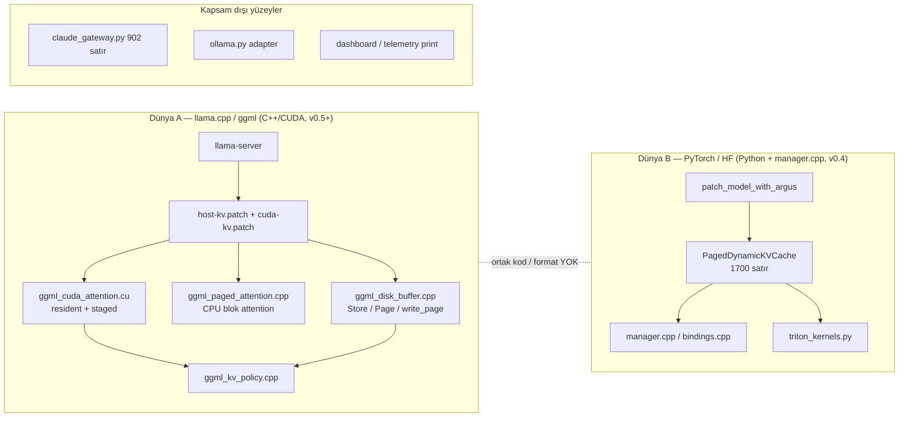

# ARGUS Deep Control Audit — v0.7-dev
**Tarih:** 2026-09-25 · **Branch:** `v0.7-dev` (HEAD `be4cc47`, çalışma ağacında commit edilmemiş E4 `cells-v2`)
**Önceki rapor:** 2026-09-04 sürümü (v0.5 öncesi, Ollama/gateway odaklı) git geçmişinde: `git show f00568c:docs/plans/control-audit.md`.

**Kapsam:** Statik ve kod düzeyinde denetim. Makine meşgul olduğu için bu turda yeni zamanlama ölçümü yok. Aşağıdaki süreler v0.6/v0.7 ölçüm raporlarından alındı ve bağlantıları verildi. Odak dört soru:
1. Darboğazlar nerede?
2. ARGUS başka projelere takılabilen bir plugin olabilir mi?
3. Proje mottosunu karşılıyor mu?
4. Planlarda nerede kalındı?

Hiçbir dosya değiştirilmedi; her madde onay bekliyor.

---

## 0. Özet — önce okunacak 5 madde

| # | Bulgu | Neden önemli | Tahmini kazanç / risk |
|---|---|---|---|
| 1 | **Decode, resident yoldan `reject_q1` ile atılıyor** ve staged yol her çağrıda buffer'ları yeniden tahsis ediyor, GPU'daki sayfaları 4 KiB'lık D2D kopyalarla taşıyor, 128 kernel launch yapıyor | Kullanıcının asıl beklediği şey decode ve stock'un 4.6x gerisinde (8.08 vs 37.02 tok/s). v0.7'de bu yol hiç ele alınmadı | Projedeki en büyük tek kaldıraç |
| 2 | llama.cpp entegrasyonu bir **patch artı kaynak derleme** olarak dağıtılıyor. Konfigürasyon 25 env var, bütçeler process-global, sadece device 0 | "Plugin" olmanın önündeki başlıca yapısal engel | Mimari iş, ölçüm gerektirmiyor |
| 3 | Desteklenmeyen bir model özelliği görülünce ARGUS **tüm süreci exception ile düşürüyor**, stock attention'a geri dönmüyor | sinks, soft-cap, MLA, ALiBi ve multi-stream kullanan model aileleri tamamen dışarıda kalıyor | Katman bazında fallback |
| 4 | Python `PagedDynamicKVCache.log_event` her sayfa olayını **sınırsız bir listeye** ekliyor ve **cwd'deki `tests/` altına dosya açıp** yazıyor, hatayı yutuyor | Bellek sızıntısı, hot-path IO, kütüphanenin kullanıcı dizinine yazması | P0, düzeltmesi küçük |
| 5 | Mottodaki "at what precision" iddiası llama.cpp yolunda **karşılanmıyor**: GGML codec'i neyse o kalıyor, sayfa bazında hassasiyet yok | README/pyproject'teki iddia amiral gemisi yolda geçerli değil | Dil düzeltmesi ya da özellik |

---

## 1. Mimari graf ve statik doğrulama

- `codebase-memory-mcp` index'i (fast): 12,274 node, 12,981 edge. Python paketleri büyük ölçüde exclude listesine düştü (`truncated: true`), bu yüzden Python analizi `ast` ve doğrudan okumayla yapıldı. **Öneri:** index exclude listesini gözden geçirin; graf şu an fiilen sadece `csrc`'yi görüyor.
- **Python suite:** `pytest --ignore=tests/test_native_llama_paged.py -k "not live"` → **378 passed**, 9 deselected, 31 s.
- **Native suite** (bu oturumda, E4 değişikliğiyle): GPU 7/7, CPU/context 8 passed + 2 skipped (quantized GGUF yok).
- **Derleme:** `nvcc -arch=sm_86` temiz. Varsayılan üç `attention_resident_cells` instantiation'ının SASS'ı HEAD ile byte byte aynı.
- **Uyarı:** `torch.jit.script_method` Python 3.14'te deprecated (14 uyarı).

### Graf ile iki ayrı dünya

A ve B aynı kavramı (sayfalı KV) iki kez uyguluyor ve ortak kod paylaşmıyorlar. Hafıza notuna göre ([[argus-cpp-python-backend-incompatibility]]) paketleme eksenleri de farklı: C++ `head_dim`, Python `seq` ekseninde paketliyor. Bu not bu turda yeniden doğrulanmadı.

---

## 2. P0 — Kritik hatalar ve performans kök nedenleri

### P0.1 Decode staged yolu: GPU'daki veri GPU'ya sayfa sayfa kopyalanıyor — **YAPILDI (E5, `077c816`)**: GPU-control decode 7.53 → 39.31 tok/s
**Dosyalar:** `argus_cache/csrc/ggml_cuda_attention.cu:550`, `:598–635` · `argus_cache/csrc/ggml_disk_buffer.cpp:101`, `:873–911`

**Kanıt:**
- `try_resident` içinde `if (ne[2] <= 1) reject(reject_q1)`: tek token'lı her decode adımı resident kernel'den dışlanıyor.
- Staged yol (`compute_impl`) **her attention çağrısında** yeniden tahsis ediyor: 2× `cudaHostAlloc` (pinned), 3× `cudaMalloc`, yeni bir `cudaStream` ve event'ler.
- Ardından context'i 32 hücrelik tile'lara bölüyor ve her tile için `argus_disk_stage_cuda` çağırıyor. Bu fonksiyon her çağrıda:
  - bir `Bounce` açıyor (mmap'li staging),
  - 4 KiB sayfa başına ayrı bir `cudaMemcpyAsync` kuyruğa koyuyor,
  - bir `cudaStreamSynchronize` bekliyor.
- Kernel (`attention_tile`) satır başına 256 thread ile çalışıyor ve her hücre için 4 `__syncthreads` yapıyor.
- Ölçülmüş sonuç ([v060-4k-attribution](../measurements/v060-4k-attribution-2026-09-17.md), [v060-checkpoint](../measurements/v060-checkpoint-2026-09-18.md)): request başına 46,080 launch, 184,320 staging memcpy, 92,160 staging çağrısı, ~743 MB D2D.
- GPU-control modunda sayfalar zaten GPU'da. Resident yol onları pointer tablosuyla yerinde okuyabiliyor.

**Risk:** Decode 8.08 tok/s, stock 37.02 tok/s (4.6x). Kullanıcının beklediği süre bu.

**Minimal çözüm, adım adım:**
1. `reject_q1`'i resident yoldan kaldırmak. Mevcut `attention_resident_cells` Q=1 ile de doğru çalışır: tek token için 14 head = 14 warp, 4 blok. Bu, token başına ~3k launch'ı katman başına 1 launch'a (token başına 24) indirir ve bütün staging kopyalarını ortadan kaldırır. Exactness kategorisi değişmez; aynı kernel, aynı zincir.
2. Q=1'de GPU'yu doldurmak için ikinci adım olarak split-K (flash-decoding) gerekir. Bu adım Kategori 1'i korumak için hücre sırasına bağlı `acc` zincirini bozmamalı, bu yüzden ayrı bir exactness kararı ister. Önce 1. adımı ölçmek gerekiyor.
3. Staged yol kalacaksa buffer'lar çağrı başına değil store ömrü boyunca tahsis edilmeli.

**Doğrulama:** `tests/cpp/test_ggml_cuda_mechanism.cpp`'ye Q=1 durumu, `test_cuda_*` suite'i ve 4K decode A/B.

### P0.2 `log_event`: sınırsız liste artı cwd'ye dosya yazma artı yutulan hata — **YAPILDI**: `EVENT_LOG_LIMIT`, trace `ARGUS_TRACE_PATH` ile opt-in, hata loglanıyor
**Dosya:** `argus_cache/core/memory_manager.py:882–902`

- Her `create/demote/resurrect` olayı `self.event_log.append(...)` ile büyüyor ve **hiç kırpılmıyor**. Uzun bir generation'da bu bir bellek sızıntısı.
- Her olayda `open("tests/argus_attention_trace.jsonl", "a")` çalışıyor: kütüphane, kullanıcının **o anki çalışma dizinine** `tests/` klasörü oluşturup yazıyor. Hot path'te syscall ve disk IO.
- `except Exception: pass` IO hatasını yutuyor.

**Çözüm:** Listeyi `collections.deque(maxlen=N)` yapmak. Dosya yazımını opt-in bir env var ya da `logging` handler'ı arkasına almak, varsayılan olarak kapatmak.

### P0.3 `Page.get` içindeki `catch (...) {}` her hatayı `default` değere çeviriyor — **YAPILDI**: yakalayıcı kaldırıldı
**Dosya:** `argus_cache/csrc/bindings.cpp:157`

`py::cast` hataları, tip uyuşmazlıkları ve undefined tensor erişimleri sessizce `None` döndürüyor. Çağıran kod bunu "alan yok" olarak yorumluyor. Bu, hatayı maskeleyen bir varsayılan.

**Çözüm:** Sadece bilinen "anahtar yok" durumunda `default` dönmek, diğer hataları yeniden fırlatmak.

### P0.4 Varsayılan `pytest` koşusu gerçek bir modeli yüklüyor — **YAPILDI**: `ARGUS_TEST_LIVE=1` opt-in; düz `pytest` 25 s
**Dosya:** `tests/test_adapters.py:339–425`

Canlı Ollama testleri sadece "sunucu ayakta mı" koşuluna bağlı. Bu makinede `ollama serve` bir sistem servisi, dolayısıyla her tam `pytest` çağrısı 22 GB'lık bir modeli yüklüyor. Bu turda suite 10 dakikadan fazla takıldı ve kullanıcının işini yavaşlattı.

**Çözüm:** CUDA testlerindeki `ARGUS_TEST_CUDA=1` gibi açık bir opt-in eklemek (`ARGUS_TEST_LIVE=1`).

---

## 3. Darboğaz haritası (prefill ve yazma yolu)

Ölçülmüş değerler v0.7 planından: [plans/argus-v0.7.0.md](../../plans/argus-v0.7.0.md) → "Possible next map".

| # | Darboğaz | Yer | Ölçülmüş / tahmini | Durum |
|---|---|---|---:|---|
| B1 | Decode staged Q=1 | P0.1 | decode 4.6x gap | **Hiç dokunulmadı** |
| B2 | Prefill attention kernel (Kategori 1 tavanı) | `ggml_cuda_attention.cu:256–431` | 1.16 s kernel; stock FA 0.073 s | E4 `cells-v2` kernel **−6.3%**, prefill ölçümü bekliyor |
| B3 | GPU-control'de sayfa başına `cudaMalloc`/`cudaFree` | `ggml_disk_buffer.cpp:185–204` (`write_page`) ve `write_run` | ≈0.07 s (12,048 çift) | Slab allocator adayı, ertelendi |
| B4 | `set_rows` satır toplama | `ggml_disk_buffer.cpp` set_rows yolu | 0.096 s | Dökümü yapılmadı |
| B5 | Staged prefill/policy-on yolunda çağrı başına pinned ve GPU tahsisi | `ggml_cuda_attention.cu:598–604` | ölçülmedi; `cudaHostAlloc` ms mertebesinde | P0.1'deki 3. adım ile aynı çözüm |
| B6 | Disk modu: sayfa başına `pwrite` + `pread` doğrulama + checksum | `ggml_disk_buffer.cpp:221–240` | policy-on 9.18 s (GPU-control 2.41 s) | E2'deki run-batching disk yoluna taşınmadı (`write_run` sadece GPU-control) |
| B7 | Tile başına `store.mutex` altında `cudaStreamSynchronize` | `ggml_disk_buffer.cpp:884–899` | tek stream'de sorun yok | Multi-sequence gelirse kilit tutarken bekleme bir contention noktası |

**M3 (< 2.25 s) hesabı:** E4 (~−0.07 s beklenen) + B3 (~0.07 s) ≈ −0.14 s. Kalan açık 0.156 s. M3'e ulaşmak için B4'ün dökümü de gerekiyor. M4 (< 2.00 s) Kategori 1 sözleşmesi altında görünür değil; bu gerekçe v0.7 planında zaten yazılı.

---

## 4. Plugin uygunluğu

Mottodaki hedef: "inference server değil, altındaki katman". Bir KV-cache yöneticisinin başka projelere takılabilmesi için gerekenler ve mevcut durum:

| Gereksinim | Mevcut durum | Bulgu |
|---|---|---|
| Kurulum bağımsızlığı | llama.cpp tarafı, sabitlenmiş bir upstream revizyonuna uygulanan 2 patch artı `-DARGUS_CORE_DIR=<repo>/argus_cache/csrc` ile kaynağın `libllama`'ya derlenmesi. pip paketi herkes için `torch`, `triton` ve `transformers` istiyor | **PL1:** İki dağıtım birimine ayrılmalı: `argus-ggml` (CMake target + statik lib + patch) ve `argus_cache[hf]` (PyTorch yolu). llama.cpp kullanıcısı torch kurmak zorunda kalmamalı |
| Programatik konfigürasyon | 25 ayrı `ARGUS_*` env var; `getenv` çağrı yolunda tekrar tekrar okunuyor (örneğin `try_resident` her attention çağrısında) | **PL2:** Tek bir `ArgusConfig` struct'ı ve C API'si (`argus_init(const argus_config *)`) ile env var'ı sadece varsayılan kaynağı yapmak |
| Çoklu instance | Bütçeler (`live[4]`, `peak[4]`) ve istatistikler process-global. `device != 0` exception fırlatıyor | **PL3:** Aynı süreçte iki model ya da iki GPU mümkün değil. Bütçeleri context'e bağlamak gerekiyor |
| Uyumsuzlukta davranış | `ggml_paged_attention.cpp:400–409` graph kurulurken `runtime_error` fırlatıyor (sinks, soft-cap, MLA, ALiBi, KQ bias, multi-stream, transposed V) | **PL4:** Katman bazında stock attention'a geri dönüş ve istatistiklerde "neden reddedildi" sayacı. Tüm süreci düşürmek bir plugin için doğru varsayılan değil |
| Multi-sequence (server `-np > 1`) | Sadece "single-stream" | **PL5:** Server senaryosunda plugin kullanılamaz. Sequence bazında sayfa tablosu yol haritasında yok |
| Kapsam temizliği | `adapters/claude_gateway.py` (902 satır, Anthropic ↔ OpenAI proxy), `core/dashboard.py`, `telemetry.print_summary` (210 satır), `hermes/`, `neo-mobile/` aynı repoda ve pakette | **PL6:** KV cache ile ilgisi olmayan yüzeyler çekirdek paketin dışına taşınmalı. Gateway en azından `argus_cache` import ağacından çıkmalı |
| Diğer runtime'lar | vLLM adapter'ı **dürüst biçimde fail-closed**; gerçek entegrasyon (`KVConnectorBase_V1` + `AttentionBackend`) yok. Ollama adapter'ı KV yönetmiyor, sadece baseline ölçüyor | Doğru ifade edilmiş. Yol haritasında vLLM KVConnector bir sonraki gerçek entegrasyon adayı |

**Güçlü yanlar (korunmalı):**
- Entegrasyon dikişi doğru seviyede: ggml `buffer_type` artı custom op. whisper.cpp veya Ollama'nın vendor'ladığı llama.cpp gibi ggml kullanan her runtime'a aynı dikişle taşınabilir.
- Env var yokken binary stock yolu izliyor (opt-in).
- Bütçeler zorlayıcı, sadece tavsiye niteliğinde değil. Hata durumunda eski sayfa korunuyor.

---

## 5. Motto ve README uyumu

| İddia (README / pyproject) | Gerçeklik | Aksiyon |
|---|---|---|
| "owning where each KV page lives **and at what precision**" | llama.cpp yolunda sayfa bazında hassasiyet yok; K/V GGML codec'inde kalıyor (`integrations/llama.cpp/README.md`: "does not implement heterogeneous precision"). Hafıza notuna göre codec'ler byte-exact uyumlu; eksik olan sayfa bazında mixed precision | Ya README'de "precision: HF yolunda" diye kapsam daraltmak ya da yol haritasına almak |
| pyproject: "FP16/FP8/INT8/INT4/INT2/1-bit tiers and CPU spill" | Bu tier'lar sadece Dünya B'de (Python/HF, v0.4) var | pyproject açıklamasını amiral gemisiyle hizalamak |
| "not a speedup engine" | Doğru ve dürüst: README 2.12x / 7.42x maliyeti açıkça yazıyor | v0.7 rakamları (1.79x) release'te güncellenmeli |
| Status tablosu "Proven" satırları | Her birinin kanıt linki var | İyi. Yeni satır önerisi: "Decode on the resident path: not implemented" |
| "context can outlive the VRAM" | Mekanizma kanıtlı. 262K uzun context ölçülmedi (açıkça ertelenmiş) | Açık kalıyor |

---

## 6. P1 — Mimari ve dosya boyutu

| Dosya | Satır | İhlal | Önerilen bölme |
|---|---:|---|---|
| `argus_cache/core/memory_manager.py` | 1972 | **Tavan aşıldı**; `PagedDynamicKVCache` 1700 satır, 103 metot | `demote/resurrect` (tiering, ~230 satır), `push/get` (veri yolu), `speculate` (prefetch), `log/telemetry` ayrı modüllere. `__init__` 292 satır: config parse ayrı bir fonksiyon olmalı |
| `argus_cache/csrc/manager.cpp` | 1055 | **Tavan aşıldı** | Dünya B'nin C++ yöneticisi. Tier geçişleri ve codec çağrıları ayrılabilir |
| `argus_cache/csrc/ggml_disk_buffer.cpp` | 1026 | **Tavan aşıldı**; store, backend buffer vtable'ı, CUDA staging, residency census ve istatistikler aynı dosyada | (a) `ggml_disk_store.cpp`: `Store`, `Page`, `write_page`, `write_run`, checksum, 1–305. (b) `ggml_disk_backend.cpp`: ggml buffer vtable, `DiskSupport`, 306–620. (c) `ggml_disk_resident.cpp`: `argus_disk_stage_cuda`, `read_resident`, census, move, 817–1026 |
| `argus_cache/adapters/claude_gateway.py` | 902 | `do_POST` 352 satır; kapsam dışı | PL6 ile birlikte paket dışına |
| `argus_cache/csrc/ggml_cuda_attention.cu` | 806 (E4 ile) | 800 uyarısı; 4 kernel ailesi, tier buffer'ları, resident/staged host kodu | Kernel'ler `ggml_cuda_attention_kernels.cuh`, `ArgusTierBuffer` ayrı dosya |
| `argus_cache/core/telemetry.py` | 397 | `print_summary` 210 satır | Tablo verisi ile formatlama ayrılmalı |

---

## 7. P2 — Pragmatik DRY ve Ponytail

- **`compute_impl` içindeki staged yol ile `resident_compute`** aynı işi (K/V'yi GPU'ya getirip attention) iki farklı yoldan yapıyor. GPU-control'de staged yol gereksiz. P0.1 düzeltmesinden sonra staged yol sadece cold (disk/RAM) sayfalar için kalmalı; mixed-residency resident yolu bunu zaten `ArgusColdStaging` ile yapıyor. Staged yolun tamamen emekliye ayrılıp ayrılamayacağı ölçülmeli.
- **`attention_resident_cells<false>` ve `<true,false>`** (cells, cells-mlp) sadece A/B referansı olarak yaşıyor. Bunlar tarihsel ölçüm varyantları. Karar: test referansı olarak mı kalacaklar, yoksa E-raporlarına bırakılıp silinecekler mi? Her biri derleme süresi ve test matrisi maliyeti.
- **`ARGUS_KV_CHECKSUM=fnv` ve `ARGUS_KV_PAGE_COMMIT=page`**: E2'de kabul edilmiş ve kapanmış A/B anahtarları. Rule of Three'ye göre gerekçesi olmayan esneklik. Kaldırmak için bir sonraki release uygun.
- **Python `zero_copy_pool.__del__`**'teki `except Exception: pass`: finalizer'da kabul edilebilir, ama en azından `logging.debug` olmalı.
- **`hybrid_cache._cache_memory_bytes`**: telemetri hatasını yutup tahmini bir formüle düşüyor. Sessiz bir sahte değer; en azından bir kez uyarı loglanmalı.

---

## 8. P3 — Ölü kod ve temizlik

- `.pytest-cache/` (git status'ta untracked): `.gitignore`'a eklenmeli. `-p no:cacheprovider` kullanılsa da ortada duruyor.
- Repo kökünde paket dışı artifact'ler: `argus_cpp_backend.cpython-314-*.so`, `neo-mobile-release.apk`, `Modelfile_*`, `Dockerfile.vllm`. Takip edilip edilmediği kontrol edilmeli; `.so` ve `.apk` repoda olmamalı.
- vLLM `cache_factory`, `target_modules` ve `strict_version` parametreleri "source compatibility" için kabul ediliyor ama hiçbir şey yapmıyor. v0.8'de kaldırılabilir.
- Graf index'i Python'u exclude ettiği için ölü fonksiyon taraması bu turda yapılamadı. Index konfigürasyonu düzeltildikten sonra tekrar koşulmalı.

---

## 9. Planlarda kalınan yer (v0.7)

| Madde | Durum |
|---|---|
| Kabul edilmiş checkpoint | `5be871e`: GPU-control 2.406 s, 1.79x, hash `a152ed56` |
| **E4 `cells-v2`** (V için half2) | Kod hazır, commit edilmedi. SASS gate geçti, varsayılan kernel'ler byte-identical. Kernel events −6.3% (5/5). **Eksik olan tek şey boş makinede profiler kapalı prefill A/B'si.** Veri: `docs/measurements/v070-e4-2026-09-25/` |
| M1 / M2 | Karşılandı |
| M3 < 2.25 s | E4 + allocator ile yaklaşılıyor, B4 dökümü gerekli |
| M4 < 2.00 s | Kategori 1 altında görünmüyor (sözleşme kararı) |
| E1 multi-second outlier | **Hâlâ açık.** Bu oturumda profiled bir v2 koşusunda 3.356 s, gürültülü ortamda 5.165 s görüldü |
| Decode | **Hiç ele alınmadı**; P0.1 |
| 262K uzun context | Ölçülmedi, ertelendi |
| llama.cpp'de sayfa bazında hassasiyet | Yol haritasında yok; motto açığı |

---

## 10. Önerilen eylem sırası (onay bekliyor)

1. **E4'ü kapatmak:** boş makinede 7 pair prefill A/B, ardından varsayılanı değiştirmek, rapor yazmak ve commit etmek. (Açık gate; önce bu kapanmalı.)
2. **P0.1 adım 1, decode'u resident yola almak:** `reject_q1`'i kaldırmak, Q=1 test durumu eklemek, decode A/B yapmak. Beklenen: staging ve launch yükünün tamamen gitmesi. Bu bir v0.7 deneyi olarak planlanmalı (E5).
3. **P0.2, P0.3, P0.4:** küçük ve düşük riskli düzeltmeler. TDD ile tek bir commit'te yapılabilir.
4. **B3 slab allocator:** M3 için gerekli.
5. **PL4 fallback** ve **PL2 config struct:** plugin olmanın ilk iki adımı. v0.8 tasarım konusu.
6. **P1 dosya bölmeleri:** davranış değiştirmeyen refactor, testler yeşil kalacak şekilde. Önce `ggml_disk_buffer.cpp`.
7. **PL1 ve PL6 paket ayrımı:** release öncesi.
