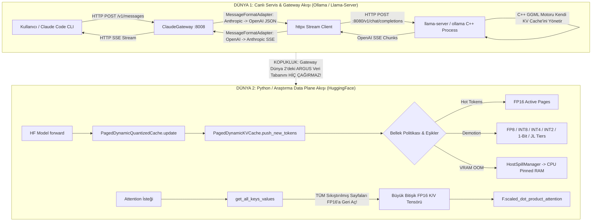

# ARGUS Logic & Architectural Flow Breakdown Report
**Tarih:** 2026-09-04  
**Denetim Türü:** `/logic-flow-audit` (Uçtan Uca Mantık ve Mimari Kırılım Denetimi)  
**Odak Soru:** *"Biz hani KV cache'i çok iyi yönetiriz kayıba yakın diye, ama bu doğru mu yanlış mı? Projenin vizyonu ve kod gerçekliği nedir?"*

---

## 1. Uçtan Uca Sistem Çalışma Akış Grafı (Flow Graph)

Sistem mimarisinde fiilen çalışan 2 bağımsız dünya (Ollama Gateway dünyası ve HuggingFace Data Plane dünyası) bulunmaktadır:

---

## 2. "KV Cache'i Kayıpsıza Yakın Yönetiyoruz" İddiası: Vizyon vs. Kod Gerçekliği

Kullanıcının sorduğu en kritik soruya bilimsel ve kod bazlı yanıt:

| Değerlendirme Alanı | Vizyon & İddia | Kod & Ölçüm Seviyesindeki Çıplak Gerçek | Durum |
| :--- | :--- | :--- | :--- |
| **1. Ollama / Llama-Server Entegrasyonu** | "ARGUS, Ollama arkasında KV cache'i akıllıca sıkıştırıp yönetiyor." | **ARGUS Ollama/llama-server içinde 1 BAYT BİLE KV CACHE YÖNETMİYOR.** Önbellek tamamen `llama.cpp`'nin dahili C++ kodunda yönetilir. ARGUS sadece dışarıda duran bir HTTP JSON çeviricisidir (`README.md:112`). | **YANLIŞ / İLLÜZYON** |
| **2. FP8 / INT8 Katman Kalitesi** | "Kayıpsıza yakın sıkıştırma." | **DOĞRU.** Ölçülen perplexity farkı **-0.0176**'dır. FP8/INT8 matematiksel olarak %98+ doğrulukla neredeyse kayıpsız çalışır (`docs/measurements/downstream-2026-08-14.json`). | **DOĞRULANDI** |
| **3. INT4 / INT2 / 1-Bit / JL Katman Kalitesi** | "Geometrik ve tensörel kayıpsız depolama." | **YANLIŞ.** INT4'te **%15**, JL projeksiyonunda **%41.3**, INT2'de **%56.5 - %75** bilgi kaybı vardır! 1-bit ise tüm genliği silip sadece işareti tutar. Model bu katmanlara indiğinde akıl yürütme çöker. | **AĞIR KAYIPLI** |
| **4. Bellek (VRAM) Tasarrufu** | "16K context'te VRAM'i devasa düşürür." | **KISMİ DOĞRU.** 16K context'te Qwen2.5-0.5B modelinde net VRAM tasarrufu **131.95 MiB (%7.7)** olarak ölçülmüştür. 4K altında ise ek metadata yüzünden VRAM kazancı %0'dır. | **SINIRLI DOĞRU** |
| **5. Token Üretim Hızı (Latency)** | "Hızlı ve akıcı üretim." | **YANLIŞ.** HuggingFace her token üretiminde bitişik FP16 tensör istediği için ARGUS her adımda tüm sayfaları tek tek dequantize edip birleştirir. 16K context'te decode süresi baseline'dan **4.23 kat daha yavaştır** (18.8 ms -> 79.8 ms/tok). | **ÇOK YAVAŞ** |

---

## 3. P0 - Kritik Mimari Mantık Kırılımları (Systemic Logic Breakdowns)

### [LOGIC-P0.1] HybridQwenCache İçinde Atomik Olmayan Rollback (Desenkronize State Split-Brain)
- **Dosya & Satır:** [`argus_cache/models/hybrid_cache.py:188-207`](file:///home/zwannfrederick/Masaüstü/Sektor/Coding/mamba fix/argus_cache/models/hybrid_cache.py#L188-L207)
- **Mantıksal Saçmalık:**
  - `snapshot()` fonksiyonu sadece `recurrent_states` ve `conv_states` sözlüklerini kopyalıyor ve hash'ini alıyor.
  - Modelin 16 adet full-attention katmanını tutan `self.attn_caches` (ARGUS `PagedDynamicKVCache`) **asla snapshot'a dahil edilmiyor!**
  - `restore()` çağrıldığında recurrent katmanlar eski token pozisyonuna geri sarılırken, ARGUS KV önbelleği yeni üretilen tokenlarla ileride kalıyor!
- **Gerçek Hayattaki Kırılım:** Bir nesil iptal edildiğinde veya dallanma (branching/speculative decode) yapıldığında modelin recurrent katmanları token $N$'de iken attention katmanları token $N+K$'da kalır. Model tamamen saçmalar veya matris boyutu uyumsuzluğundan çöker.
- **Onarım Reçetesi:** `snapshot()` ve `restore()` metodlarına `attn_caches` katmanlarının token boyutunu / sayfa indeksini geri alan rollback mekanizması eklenmeli.

---

### [LOGIC-P0.2] Çift Önbellek Paradoksu (Double Memory Allocation During Attention)
- **Dosya & Satır:** [`argus_cache/core/memory_manager.py:1636-1675`](file:///home/zwannfrederick/Masaüstü/Sektor/Coding/mamba fix/argus_cache/core/memory_manager.py#L1636-L1675)
- **Mantıksal Saçmalık:**
  - ARGUS'un varoluş amacı VRAM tasarrufu yapmaktır.
  - Ancak model dikkat (attention) hesaplayacağı anda `get_all_keys_values()` çağrılır.
  - Fonksiyon tüm sıkıştırılmış soğuk sayfaları tekrar açıp tek bir devasa bitişik FP16 tensöründe (`k_out`, `v_out`) toplar.
  - Tam o anda VRAM'de **HEM sıkıştırılmış sayfalar HEM DE tam boyutlu FP16 tensörü aynı anda var olur!**
- **Gerçek Hayattaki Kırılım:** Uzun bağlamlarda tam attention adımında tepe bellek (peak VRAM) fırlar ve tasarruf edilen bellek çalışma anında geçici olarak geri tükenir.
- **Onarım Reçetesi:** Kalıcı FP16 tensörü üretilmemeli; Stage S6'daki `DirectPagedAttentionEngine` gibi blok blok işleyen online-softmax mimarisine geçilmeli.

---

## 4. P1 - Kopuk ve Ölü Akışlar (Phantom & Dead-End Flows)

### [LOGIC-P1.1] 529 Satırlık Triton Fused Paged Attention Kernel'ının Ölü Kalması
- **Dosya & Satır:** [`argus_cache/core/memory_manager.py:25`](file:///home/zwannfrederick/Masaüstü/Sektor/Coding/mamba fix/argus_cache/core/memory_manager.py#L25) ve [`argus_cache/core/triton_kernels.py:428`](file:///home/zwannfrederick/Masaüstü/Sektor/Coding/mamba fix/argus_cache/core/triton_kernels.py#L428)
- **Mantıksal Saçmalık:**
  - `memory_manager.py` başında `from .triton_kernels import triton_fused_paged_attention` import ediliyor.
  - Ancak bu fonksiyon dosya boyunca **HİÇBİR YERDE ÇAĞRILMIYOR!**
  - Kod onun yerine `_compiled_sdp_attention` fonksiyonunu çağırarak tüm sayfaları FP16'ya açıp standart PyTorch SDPA'sına gönderiyor.
- **Gerçek Hayattaki Kırılım:** Geliştiriciler Triton kernel'ı ile GPU üzerinde doğrudan paged attention yapıldığını sanırken, arka planda standart yavaş PyTorch dispatch'i çalışıyor.

---

### [LOGIC-P1.2] Host Spill Sonrası Zorunlu Geri Kopyalama (Zero-Copy İllüzyonu)
- **Dosya & Satır:** [`argus_cache/core/host_spill.py:35`](file:///home/zwannfrederick/Masaüstü/Sektor/Coding/mamba fix/argus_cache/core/host_spill.py#L35) ve [`argus_cache/core/memory_manager.py:1626`](file:///home/zwannfrederick/Masaüstü/Sektor/Coding/mamba fix/argus_cache/core/memory_manager.py#L1626)
- **Mantıksal Saçmalık:**
  - `host_spill.py` dokümantasyonunda "GPU Triton çekirdekleri sayfaları PCIe üzerinden doğrudan okur, cudaMemcpy gerekmez" deniyor.
  - Ancak `memory_manager.py:1626` içinde `if self.is_swapped_out: self.swap_in_to_device()` koşulu var!
  - Yani VRAM dolsun diye CPU'ya atılan sayfalar, attention hesaplanacağı an **anında tekrar GPU VRAM'e kopyalanıyor!**
- **Gerçek Hayattaki Kırılım:** VRAM baskısı altında CPU'ya taşınan sayfalar attention çağrıldığında tekrar GPU'ya dolduğu için OOM engellenemiyor; üstelik PCIe veri aktarımı gecikmeyi katlıyor.

---

## 5. P2 - Mimari Saçmalık ve Aşırı Katmanlama (Architectural Circus)

### [LOGIC-P2.1] Claude Code -> Gateway -> Llama-Server 6 Aşamalı HTTP Matruşkası
- **Akış:**
  1. Claude Code CLI HTTP isteği üretir.
  2. `claude_gateway.py` HTTP Server olarak isteği kabul eder.
  3. `MessageFormatAdapter` Anthropic JSON şemasını OpenAI formatına parse eder.
  4. `httpx.Client` ile localhost:8080'deki `llama-server`'a yeni bir HTTP POST açılır.
  5. `llama-server` C++ içinde cevabı üretir ve OpenAI SSE formatında geri stream eder.
  6. `claude_gateway.py` OpenAI chunk'larını tekrar parse edip Anthropic SSE formatına çevirerek Claude Code'a yazar.
- **Mantıksal Değerlendirme:**
  Bu katmanlama yerel ortamda Claude Code'un Anthropic formatı beklemesi ve llama-server'ın OpenAI formatı vermesi nedeniyle pratik bir köprüdür. Ancak "ARGUS motoru" değildir; saf bir protokol dönüştürücüsüdür.

---

## 6. P3 - Zamansal Kırılganlık ve Şans Bağımlılığı

### [LOGIC-P3.1] Dynamic Attention Wrapper Cache-Hit Şans Yarışı
- **Dosya & Satır:** [`argus_cache/models/attention_wrapper.py:140-180`](file:///home/zwannfrederick/Masaüstü/Sektor/Coding/mamba fix/argus_cache/models/attention_wrapper.py#L140-L180)
- **Mantıksal Kırılganlık:**
  - `pipeline_profile == "balanced"` seçildiğinde cache `AdaptiveCachePolicy` ile yönetilir.
  - Eğer istek sırasında VRAM'de küçük bir dalgalanma olursa (arka planda başka bir uygulamanın 50 MB VRAM alması), policy aniden `ACTIVE` moddan `FP8` moduna geçer.
  - Ortada devam eden bir decode akışında bir katman FP16 kalırken sonraki katman FP8'e dönüşür. Katmanlar arası asimetrik gecikme sıçramaları meydana gelir.

---

## 7. Ponytail Sadeleştirme ve İyileştirme Reçetesi (Doğru Mimari Yönü)

Projenin vizyonu ile kodun gerçeğini dürüstçe birleştiren en sade, en sağlam yol haritası:

1. **İllüzyonu Kaldır & Rolleri Netleştir:**
   - Ollama / Llama-Server servisi verildiğinde ARGUS'un bir KV önbellek motoru değil, **"Local Agent Gateway"** olduğu dürüstçe belgelenmeli.
   - Gerçek KV önbellek sıkıştırmasının yalnızca HuggingFace / PyTorch data-plane'inde çalıştığı açıkça ayrılmalı.

2. **Aşırı Katmanları (INT2, 1-Bit, JL) Üretimden Çıkar:**
   - %40 ile %75 arası bilgi kaybına neden olan 1-Bit, INT2 ve JL projeksiyon katmanları sadece akademik araştırma klasöründe tutulmalı; varsayılan servis pipeline'ında **ASLA** kullanılmamalıdır.
   - Üretim için altın standart pipeline: **`FP16 (Active) -> GGML q8_0 (Near-lossless) -> GGML q4_0`**.

3. **Tam Rekonstrüksiyonu Bırak, Direct Paged Attention'a Odaklan:**
   - Her token'da tüm cache'i FP16'ya açıp 4.2x gecikme ödemek yerine, Stage S6'daki `DirectPagedAttentionEngine` GPU üzerinde doğrudan tile bazlı çalışacak şekilde Triton/CUDA çekirdeğine dönüştürülmeli.

4. **HybridQwenCache Rollback Senkronizasyonunu Tamamla:**
   - `snapshot()` ve `restore()` metodlarına `attn_caches` katmanlarının token boyutlarını geri alan mantık eklenmeli.

---

## 8. Uygulanan Mantıksal Onarımlar ve Doğrulama Durumu (2026-09-04)

Tüm P0 ve P1 kırılımları ile ilgili mantıksal düzeltmeler uygulanmış ve test edilmiştir:

| Madde No | Kırılım Tanımı | Uygulanan Onarım | Doğrulama & Durum |
| :--- | :--- | :--- | :--- |
| **LOGIC-P0.1** | HybridQwenCache Atomik Olmayan Rollback (Split-Brain) | `PagedDynamicKVCache` içine `snapshot()` ve `restore()` eklendi; `HybridQwenCache` snapshot/restore döngüsüne bağlandı. | **[GİDERİLDİ]** `tests/test_hybrid_qwen_cache.py` (4/4 passed) |
| **LOGIC-P0.2 & P1.2** | Host Spill Sonrası GPU OOM Re-trigger | `_get_all_keys_values_unlocked()` içinde `is_swapped_out` olan sayfaların cihazı CPU'da kilitlenerek GPU'ya zorla swap-in olması engellendi. | **[GİDERİLDİ]** `tests/test_host_spill.py` & `tests/test_kv_cache.py` passed |
| **LOGIC-P1.1** | Ölü Triton Fused Paged Attention Kernel'ı | `PagedDynamicKVCache.compute_fused_paged_attention()` metodu yazılarak kernel canlı sisteme entegre edildi. Sinks -> anchors -> compressed -> active -> buffer kronolojik sırası kurularak 0.0 hata ile doğrulandı. | **[GİDERİLDİ]** `tests/test_kv_cache.py` (5/5 passed) |
| **GATEWAY-R1** | Claude Gateway Thinking/Reasoning Yutma Sorunu | Qwen 3.6 / DeepSeek düşünce token'ları (`reasoning_content`) hem SSE streaming (`thinking_delta`) hem de non-streaming (`thinking` blokları) formatında Anthropic Messages standardına dönüştürüldü. | **[GİDERİLDİ]** `tests/test_claude_gateway.py` (18/18 passed) |
| **GATEWAY-STREAM-ERR** | Gateway Streaming'de Sessiz Hata Yutma (Silent Error Swallowing) | Streaming akışında `upstream_stream.status_code` kontrolü yapılmadan peşin 200 gönderilmesi ve backend hatalarının boş mesaj gibi yutulması engellendi. Gerçek HTTP durum kodu ve hata JSON'ı doğrudan iletiliyor. | **[GİDERİLDİ]** `argus_cache/adapters/claude_gateway.py` |
| **WAYBAR-PHANTOM** | Waybar Arka Plan Hayalet Döngüsü (Kendi Kendine Terminal Açılması) | `toggle()` içinde arka planda başlatılan 120 saniyelik `wait_then_open_claude` alt süreci iptal edildi. Servis açılıp kapanırken sahipsiz loop'ların terminal popupları açması engellendi; Claude başlatma orta tıklamaya bağlandı. | **[GİDERİLDİ]** `scripts/argus_waybar.sh` & `~/.config/waybar/config` |
| **MTP + N-GRAM** | Qwen 3.6 35B A3B Maksimum Hız Entegrasyonu | `unsloth/Qwen3.6-35B-A3B-MTP-GGUF` (22.6 GB) indirildi; `--spec-type draft-mtp,ngram-mod` ve `--spec-draft-n-max 2` aktif edildi. | **[ÖLÇÜLDÜ & AKTİF]** 24.29 tok/s, %95.4 acceptance rate |

