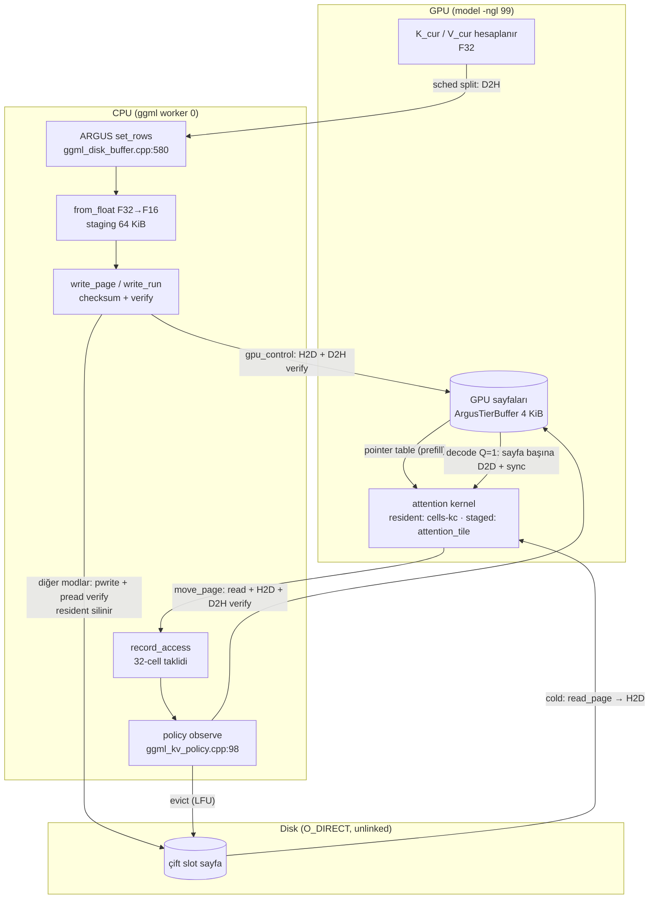

# ARGUS Logic & Flow Breakdown — llama.cpp yolu, v0.7-dev
**Tarih:** 2026-09-25 · **Denetim:** `/logic-audit` · **Eşlik eden rapor:** [control-audit.md](control-audit.md). Oradaki maddeler burada tekrar edilmedi; sadece referans verildi.
**Önceki sürüm:** 2026-09-04 (Ollama/HF dünyası odaklı), `git show f00568c:docs/plans/logic-flow-breakdown.md`.

**Soru:** Testler geçiyor ve çıktılar bit-exact. Peki KV sayfasının yolculuğu mantıklı mı? Bir sayfa doğduğu yerden okunduğu yere en kısa ve en doğru yoldan gidiyor mu?

---

## 1. Sistem akış grafı

```mermaid
flowchart TD
  subgraph GPU["GPU (model -ngl 99)"]
    QKV[K_cur / V_cur hesaplanır<br/>F32]
    ATT[attention kernel<br/>resident: cells-kc · staged: attention_tile]
    PG[(GPU sayfaları<br/>ArgusTierBuffer 4 KiB)]
  end
  subgraph CPU["CPU (ggml worker 0)"]
    SR[ARGUS set_rows<br/>ggml_disk_buffer.cpp:580]
    ENC[from_float F32→F16<br/>staging 64 KiB]
    WP[write_page / write_run<br/>checksum + verify]
    POL[policy observe<br/>ggml_kv_policy.cpp:98]
    RA[record_access<br/>32-cell taklidi]
  end
  subgraph DISK["Disk (O_DIRECT, unlinked)"]
    DP[(çift slot sayfa)]
  end

  QKV -- "sched split: D2H" --> SR --> ENC --> WP
  WP -- "gpu_control: H2D + D2H verify" --> PG
  WP -- "diğer modlar: pwrite + pread verify<br/>resident silinir" --> DP
  PG -- "pointer table (prefill)" --> ATT
  DP -- "cold: read_page → H2D" --> ATT
  PG -- "decode Q=1: sayfa başına D2D + sync" --> ATT
  ATT --> RA --> POL
  POL -- "move_page: read + H2D + D2H verify" --> PG
  POL -- "evict (LFU)" --> DP
```

**Okuma kılavuzu:** GPU'da doğan bir K/V satırı prefill'de en az 4 sınır geçiyor: D2H, CPU encode, H2D ve verify için tekrar D2H. Policy-on modunda buna disk turu da ekleniyor: pwrite, pread, sonra cold read, sonra promote. Aşağıdaki kırılımlar bu yolculuğun neden bu şekilde olduğunu ve nerede kendisiyle çeliştiğini gösteriyor.

---

## 2. P0 — Kritik mantık kırılımları

### L0.1 Yazma, terfiyi siliyor: en sıcak sayfa her token'da en yavaş katmana düşüyor
- **Akışın başladığı yer:** decode'da her token katman başına bir satır ekliyor (`set_rows`, `ggml_disk_buffer.cpp:580`). Satır sayfanın ortasına düştüğü için `transfer()` read-modify-write yapıyor (`:374`, `:381–382`).
- **Koptuğu yer:** `write_page` disk yolunda (`ggml_disk_buffer.cpp:221–240`) yeni içeriği diske yazıp doğruluyor, sonra `delete descriptor.resident; descriptor.resident = nullptr;` çalışıyor (`:233–236`). Policy o sayfayı GPU'ya terfi ettirmiş olsa bile bu yeniden yazımla sayfa diske düşüyor.
- **Sonraki adım:** Bir sonraki attention bu sayfayı cold olarak okuyor (`argus_disk_read_resident`, `:1003`, `read_page`). Ardından policy onu tekrar terfi ettiriyor (`ggml_kv_policy.cpp:108–115`): `access_count` sıfırlanmadığı için "iki okuma" eşiği anında geçiliyor. Terfi de bir disk okuması, H2D kopyası ve doğrulama için D2H kopyası demek (`move_page`, `:817–842`).
- **Neden hata vermiyor:** Her adım doğru ve doğrulanmış; sadece sonuç anlamsız. Bir sonraki okumanın kesin olduğu kuyruk sayfası, token başına ve katman başına disk → GPU ping-pong yapıyor.
- **Gerçek kırılım:** Dar bütçeli policy-on decode ölçümü 0.991 tok/s ve 10.979 s disk-read beklemesi ([v060-4k-attribution](../measurements/v060-4k-attribution-2026-09-17.md)). v0.7 kampanyası bu modu hiç ölçmedi.
- **Reçete:** Yazma yerleşimi = mevcut yerleşim. Sayfa bir tier'da resident ise yeni içeriği o tier'a yazıp orada doğrulamak. Disk kopyası isteniyorsa arka planda backing copy olarak güncellemek; `placement_revision` değişmez.

### L0.2 ~~Isı ters çalışıyor~~ — GERİ ÇEKİLDİ (E6, 2026-09-25)
Tam causal attention'da her görünür sayfa her adımda okunuyor. Bu yüzden "kesin okunacak sayfa" nitelemesi hepsi için geçerli. Tier'dan büyük döngüsel bir taramada hit oranını belirleyen şey *sabit* bir alt kümenin tutulması, ve monoton LFU sayaçları bunu zaten sağlıyor. Önerilen "yeniden yazımda sayacı sıfırla" düzeltmesi kuyruk sayfasını her token'da kurban yapardı. Geçerli kalan tek şey küçük bir P3: `last_access_step` toplanıyor ama policy tarafından kullanılmıyor. Ayrıntı: [E6 raporu](../measurements/v070-e6-policy-logic-2026-09-25.md).

### L0.3 Terfi, attention scratch'inin payını dolduruyordu (ölçümle bulundu, E6'da düzeltildi)
- `argus_kv_policy_prepare` her çağrıdan önce scratch için sayfa atıyor (`ggml_kv_policy.cpp`, `force=true`).
- Attention bitince `observe` o boşluğa terfi ediyordu, sonraki `prepare` aynı sayfaları tekrar atıyordu.
- Dar bütçede (GPU 2 MiB) request başına 78,680 terfi ve 78,496 demote, 3.04 GB okuma.
- **Düzeltme:** `observe` son `prepare`'in ayırdığı payı boş bırakıyor. Sonuç: 36 terfi / 34 demote, okuma −30%, prefill −10–13%.

**L0.1 durumu:** E6'da düzeltildi. Resident kopya doğrulanmış byte'larla tazeleniyor. 64 MiB bütçede kararlı durumda terfi 12,768 → 0, `read_bytes` −67%.

---

## 3. P1 — Kopuk ve ölü akışlar

### L1.1 v0.7 kampanyası bir teşhis modunu optimize ediyor
- `gpu_control` kodda açıkça "Diagnostic GPU-authoritative storage; no disk fallback" (`ggml_disk_buffer.cpp:52`, `:186`) ve "cannot migrate out of GPU" (`:824`) olarak tanımlı.
- v0.7'deki bütün M1–M4 hedefleri ve kabul kriterleri bu moda göre (`plans/argus-v0.7.0.md`, "Workload and method").
- Ürün modları (policy-on: 9.18 s; disk: ölçülmedi) v0.7'de sadece regresyon kontrolü olarak koşuldu.
- **Sonuç:** Kampanya kernel'i ve GPU-control yazma yolunu hızlandırıyor. Bu kazançların bir kısmı (kernel, E4) her moda taşınıyor, ama L0.1 ve L0.3 ürün modunun asıl kaybıydı ve kampanyanın dışında kalıyordu (ikisi de E6'da düzeltildi).
- **Reçete:** v0.7'nin sonraki ölçüm matrisine policy-on prefill ve decode'u birinci sınıf metrik olarak eklemek.

### L1.2 Yeni sayfa her zaman soğuk doğuyor (write-time admission yok)
- `gpu_control` dışındaki modlarda `write_page` her zaman diske yazıyor. Policy yerleşim kararını sadece okumadan sonra veriyor (`observe`, `access_count ≥ 2`).
- Prefill'de yazılan her sayfa, tier bütçesi boş olsa bile önce disk turu yapıyor ve iki attention okumasından sonra terfi ediyor.
- **Reçete:** Yazma anında hedef tier'ın bütçesi varsa oraya yazmak (admission). Policy sadece bütçe dolunca devreye girmeli.

### L1.3 İki dünya arasında köprü yok
- Mottodaki heterojen hassasiyet (FP8/INT4/INT2/1-bit, JL projeksiyonu) sadece Python `PagedDynamicKVCache` + `manager.cpp` dünyasında var.
- llama.cpp yolu Python `PageStore`'a bağlı değil (`integrations/llama.cpp/README.md`: "does not connect Python PageStore, implement heterogeneous precision").
- Paketleme eksenleri de uyumsuz ([[argus-cpp-python-backend-incompatibility]], bu turda yeniden doğrulanmadı).
- **Sonuç:** Projenin iki yarısı aynı kavramın iki ayrı implementasyonu. Birindeki gelişme diğerine akmıyor.
- **Reçete:** Hangi dünyanın ürün olduğuna karar vermek (kanıtlar llama.cpp'yi gösteriyor) ve diğerini "legacy/HF deneyi" olarak etiketlemek. Hassasiyeti llama.cpp sayfa descriptor'una (`Page.codec` zaten var) taşımak ayrı bir tasarım konusu.

### L1.4 Policy'nin saati, staged yolun tile boyuyla tanımlı
- Resident yol, policy kararları staged yolla birebir aynı kalsın diye 32 hücrelik okuma geçmişini taklit ediyor (`ggml_disk_buffer.cpp:1017–1023`).
- Her `record_access` `access_step`'i artırıyor. "Zaman" token değil tile okuması; bu yüzden aynı recency farkı context uzunluğuyla ölçekleniyor.
- Şu an zararsız, çünkü `access_step` kullanılmıyor. L0.2 geri çekildiği için LRU gündemde değil; recency ileride kullanılırsa önce saatin çağrı (token) başına bir kez ilerlemesi gerekir.
- Control-audit P0.1'deki decode geçişi (Q=1'in resident yola alınması) bu taklidi de miras alacak.

---

## 4. P2 — Mimari saçmalık ve gereksiz dolambaç

### L2.1 Yazma yolu: GPU'da doğan veri host'a iniyor ve geri çıkıyor
- **Zincir:** `K_cur` GPU'da hesaplanıyor. ARGUS `set_rows`, host buffer type'ına bağlı bir CPU custom op olduğu için (`DiskSupport`, `:575–578`; `argus_ggml_disk_set_rows`, `:765–778`) scheduler katman başına bir CPU split'i ve D2H kopyası ekliyor.
- CPU `from_float` ile F16'ya kodluyor (`:606–607`). `write_run` pinned staging'den H2D kopyalıyor, doğrulama için D2H okuyor ve CPU'da CRC hesaplıyor (`:264–287`).
- **Ölçülmüş bedel:** nsys'e göre ARGUS'ta GPU 1.049 s boşta, stock'ta 0.470 s (+0.58 s). Plandaki ifadeyle: "GPU idle in ARGUS is the CPU critical path between GPU work, dominated by `set_rows` page writes" (`plans/argus-v0.7.0.md`, nsys bölümü). E2 bu yolu ucuzlattı ama yolun şeklini değiştirmedi.
- **Reçete:** GPU-resident sayfalar için GPU tarafında bir `set_rows`: attention'ın kullandığı pointer tablosuyla satırları doğrudan sayfaya yazan bir kernel; doğrulama gerekiyorsa digest'i de GPU'da hesaplayan. Bu, katman başına CPU split'ini ve iki kopyayı kaldırır. Prefill'deki boşta GPU süresine vuran en büyük yapısal kaldıraç bu. Doğrulama sözleşmesine dokunduğu için ayrı bir kampanya olmalı.

### L2.2 Staged decode yolu: GPU'dan GPU'ya sayfa sayfa bounce
Control-audit P0.1'de. Akış açısından not: staged yol resident sayfalar için D2D yapıyor (`:891–893`), ama her çağrıda bir `Bounce` açıyor ve tile başına bir kez senkronize oluyor. Pointer tablosu zaten var olduğu halde veri kopyalanıyor.

### L2.3 Her ekleme için read-modify-write
Decode'da 256 B'lık tek satır için tam bir 4 KiB sayfa okunuyor, birleştiriliyor, yazılıyor ve doğrulanıyor (`transfer`, `:381–383`). Sayfa GPU'daysa bu read, write ve verify'ın üçü de host üzerinden gidiyor. L2.1'deki GPU `set_rows` bunu da çözer.

---

## 5. P3 — Zamansal kırılganlıklar ve gizli yarış koşulları

| # | Bulgu | Yer | Bugün | Ne zaman patlar |
|---|---|---|---|---|
| L3.1 | `registry_mutex` ve iki store mutex'i kernel süresince ve `cudaStreamSynchronize` boyunca tutuluyor | `ggml_disk_buffer.cpp:961–965` (ponytail notu var) | Tek stream'de doğru | Multi-sequence veya çoklu context geldiğinde bütün attention'lar seri çalışır |
| L3.2 | `set_rows` her exception'da `GGML_ABORT` çağırıyor | `:614–616` | Veri tutarlılığı korunuyor (dosya unlinked) | Bütçe dolması bir runtime durumu, bug değil. Plugin için host sürecini öldürmek aşırı (control-audit PL4) |
| L3.3 | `prepare` zorunlu tahliye döngüsü her kurban için bütün sayfaları tarıyor | `ggml_kv_policy.cpp:58–68`, `:87–89` | 4K'da ≈0 | Büyük context'te O(n²) (ponytail notu var) |
| L3.4 | Revizyon kontrolü "önce oku, sonra doğrula" şeklinde | `ggml_cuda_attention.cu:584`, `:590`, `:643` | Tek thread'li graph'ta doğru | Bir yazma başka bir thread'den gelirse attention bayat veriyle biter ve sonra throw eder. Kurtarma yok, sadece tespit var |
| L3.5 | Policy `move` exception'ları sayarak yutuyor | `ggml_kv_policy.cpp:44–51` | Sayaç var (`policy_rejected`), sessiz değil | Kabul edilebilir; nedenlerin ayrı sayılması teşhisi kolaylaştırır |

---

## 6. Ponytail uyumlu cerrahi reçete (öncelik sırasıyla, onay bekliyor)

| Sıra | Değişiklik | Boyut | Doğrulama |
|---|---|---|---|
| 1 | ~~L0.2~~ geri çekildi; yerine **L0.3** (scratch headroom) — **yapıldı, E6** | — | — |
| 2 | **Yapıldı (E6).** **L0.1:** resident sayfaya yazmak onu diske düşürmesin. Resident tier'a yazıp doğrulamak; disk kopyası backing copy olarak kalır | `write_page` içinde bir dal | `test_ggml_disk_buffer` short-write ve corrupt-page testleri ile policy off/on eşitliği; dar bütçeli decode ölçümü (0.991 tok/s baseline) |
| 3 | **L1.2:** yazma anında admission (hedef tier bütçesi varsa) | `write_page`'e yerleşim girdisi | Policy census; `peak_*` bütçeleri |
| 4 | **L2.1:** GPU-side `set_rows` (GPU-resident sayfalar için) | Yeni kernel; doğrulama sözleşmesi kararı gerekli | Hash `a152ed56`; nsys GPU idle |
| 5 | **L1.1:** v0.7 ölçüm matrisine policy-on prefill ve decode eklemek | Plan değişikliği | — |

1–3. adımlar ürün modunun (policy-on) mantık hatalarını düzeltiyor ve küçükler. 4. adım GPU-control dahil bütün modlarda boşta GPU süresine vuruyor. Control-audit P0.1 (decode'u resident yola almak) ile birlikte, v0.7 sonrası en büyük üç kaldıraç: decode yolu, yazma yolunun yeri ve policy'nin ısı modeli.
